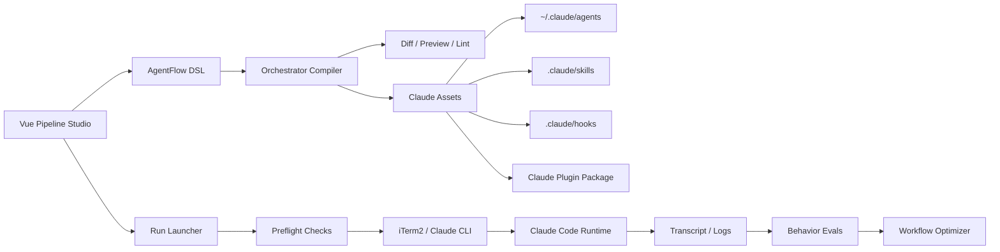

# AgentFlow 方案：从流程画布到 Agent Organization Compiler

> 调研日期：2026-04-17  
> 当前阶段：前端编程期，先稳定“单/多流水线配置 + Claude Agents 同步 + iTerm2 启动”闭环，再进入全栈化与运行态深化。

## 1. 核心结论

AgentFlow 不应该只是“流程编排 UI”，也不应该把重点放在网页内嵌终端、tmux 画面复刻上。更有价值的方向是：

**AgentFlow = 面向 Claude Code / 本地 Agent 工作流的 Agent Organization Compiler。**

它把用户在页面上配置的流水线、阶段、角色、职责、技能、质量门禁、委托策略，编译成 Claude Code 真正能识别和执行的资产：

- Team Leader agent markdown
- 共享/专属 subagent 定义
- `SKILL.md` 技能包
- hooks 质量门禁
- Claude plugin/marketplace 包
- 一键启动 prompt
- 行为测试 fixture
- 后续可扩展的 MCP resources/prompts/tools

一句话：

**页面负责建模，Orchestrator 负责编译，Claude Code 负责执行，AgentFlow 负责让这套组织资产可视化、可预览、可版本化、可测试、可分发。**

这条路比“自己做执行引擎”更快，也更贴近当前 Claude Code 生态的真实能力。

## 2. 行业调研摘要

### 2.1 Claude Code 生态：本地 Agent 资产正在标准化

Claude Code 现在已经形成了明显的本地自动化层：

- **Subagents**：专门化 AI 助手，有独立 context window、独立工具权限和自定义 system prompt。官方建议用于隔离高噪声探索、专项审查、并行研究等场景。参考：[Claude Code subagents](https://code.claude.com/docs/en/sub-agents)。
- **Agent Teams**：多个 Claude Code session 组成团队，由 team lead 协调，共享任务列表和消息系统。官方文档明确：适合并行研究、跨层改造、竞争性假设排查；成本更高，且目前 experimental、默认关闭、一个 session 只能管理一个 team、不支持 nested teams。参考：[Claude Code agent teams](https://code.claude.com/docs/en/agent-teams)。
- **Skills**：`SKILL.md` 已经成为可复用工作流单元。Skill 可以放在个人、项目、插件目录，支持 frontmatter、自动触发、支持文件、脚本等。参考：[Claude Code skills](https://code.claude.com/docs/en/skills)。
- **Hooks**：Claude Code 生命周期事件可被 shell/HTTP/prompt/agent hook 拦截，包含 `PreToolUse`、`PostToolUse`、`SubagentStart`、`SubagentStop`、`TaskCreated`、`TaskCompleted`、`TeammateIdle` 等，适合做质量门禁和审计。参考：[Claude Code hooks](https://code.claude.com/docs/en/hooks)。
- **Plugins/Marketplaces**：插件可以打包 skills、agents、hooks、MCP servers、LSP servers，并通过 marketplace 分发。参考：[Claude Code plugins](https://code.claude.com/docs/en/plugins) 与 [plugin marketplace](https://code.claude.com/docs/en/plugin-marketplaces)。

对 AgentFlow 的启发：

- 我们不需要重新发明 Agent 执行 runtime。
- 我们应该成为 Claude Code 资产的可视化编辑器、编译器、测试器和分发器。
- 当前项目里写 `/Users/leo/.claude/agents` 是对的，但下一步要扩展到 `.claude/skills`、`.claude/hooks`、plugin package。

### 2.2 Superpowers：Skill 化工作流 + 行为测试

[Superpowers](https://github.com/obra/superpowers) 的核心不是一个框架，而是一套强约束的软件研发工作流，安装后通过 skills 让 Claude 自动遵守：

- brainstorming
- writing-plans
- subagent-driven-development
- test-driven-development
- requesting-code-review
- verification-before-completion
- finishing-a-development-branch

它最值得学习的不是某个具体 prompt，而是三件事：

- **工作流被拆成可触发 skills**：每个 skill 用 `name/description` 声明触发条件。
- **流程带质量门禁**：例如 subagent-driven-development 明确要求 implementer、spec reviewer、code quality reviewer 两级审查。
- **测试不只测代码，还测 Agent 行为**：通过 headless Claude session transcript 检查 skill 是否触发、subagent 是否派发、review 顺序是否正确。参考：[Superpowers testing](https://github.com/obra/superpowers/blob/main/docs/testing.md)。

对 AgentFlow 的启发：

- “Skill 管理”不能只是一个 UI 列表，而应该能生成真实 `SKILL.md`。
- 每条流水线至少要生成一个 `using-agentflow` bootstrap skill，要求 Leader 在行动前加载组织规则、委托策略、产物门禁。
- AgentFlow 需要“行为测试”，不是只靠人工肉眼看生成的 markdown。

### 2.3 MetaGPT：Code = SOP(Team)

[MetaGPT](https://github.com/FoundationAgents/MetaGPT) 的核心理念是 `Code = SOP(Team)`，也就是把标准作业流程注入多 Agent 团队。它的结构很清楚：

- `Team`：雇佣多个角色。
- `Role`：有 profile、goal、constraints、actions、watch 规则。
- `Action`：具体可执行步骤。
- `Environment`：负责消息广播和角色间通信。
- `Message`：包含 `cause_by`、`send_to`、metadata，用于路由。

论文 [MetaGPT: Meta Programming for A Multi-Agent Collaborative Framework](https://openreview.net/forum?id=VtmBAGCN7o) 强调 SOP、角色分工、中间产物和审核机制对多 Agent 稳定性的重要性。

对 AgentFlow 的启发：

- 当前 DSL 里只有 `stages/agents/skills` 还不够，要引入 `actions/artifacts/gates/watch/produce`。
- Team Leader 不是“高级 prompt”，而是一个组织路由器：它要知道谁监听什么、谁产出什么、什么时候进入下一阶段。
- 但我们不应照搬 MetaGPT Python runtime，而是把它的组织模型编译到 Claude Code agents/skills/hooks。

### 2.4 LangGraph / AutoGen / CrewAI / ADK / OpenAI Agents SDK：代码框架的共同方向

当前主流代码框架有明显趋同：

- **LangGraph** 重视 durable execution、streaming、human-in-the-loop、memory、checkpoint。参考：[LangGraph overview](https://docs.langchain.com/langgraph) 与 [durable execution](https://docs.langchain.com/oss/python/langgraph/durable-execution)。
- **AutoGen AgentChat** 强调 agents、teams、SelectorGroupChat、GraphFlow、state、logging，其中 SelectorGroupChat 用模型基于上下文选择下一个说话者。参考：[AutoGen AgentChat](https://microsoft.github.io/autogen/stable/user-guide/agentchat-user-guide/index.html) 与 [SelectorGroupChat](https://microsoft.github.io/autogen/stable/user-guide/agentchat-user-guide/selector-group-chat.html)。
- **CrewAI** 把 agents、crews、flows、guardrails、memory、knowledge、observability 做成产品化概念。参考：[CrewAI docs](https://docs.crewai.com/) 与 [CrewAI flows](https://docs.crewai.com/en/concepts/flows)。
- **Google ADK** 明确区分 LLM Agent、Workflow Agent、Custom Agent，支持 Sequential/Parallel/Loop 等结构化编排。参考：[Google ADK agents](https://google.github.io/adk-docs/agents/) 与 [multi-agent systems](https://google.github.io/adk-docs/agents/multi-agents/)。
- **OpenAI Agents SDK** 用少量 primitives 表达 agent 应用：Agents、agents-as-tools、handoffs、guardrails、tracing。参考：[OpenAI Agents SDK](https://openai.github.io/openai-agents-python/)、[handoffs](https://openai.github.io/openai-agents-python/handoffs/)、[tracing](https://openai.github.io/openai-agents-python/tracing/)。

对 AgentFlow 的启发：

- 业界共识不是“所有事都让一个 Agent 自己想”，而是把流程、状态、交接、门禁显式化。
- 多 Agent 框架有价值，但对我们的当前阶段过重。AgentFlow 应先做 Claude Code 原生资产编译，再保留导出 LangGraph/CrewAI/ADK 的可能。
- `guardrails/tracing/durable execution` 要进入路线图，但不要在 MVP 把它们全做成复杂 runtime。

### 2.5 可视化编排工具：Flowise / Langflow / Dify / n8n 的边界

视觉编排平台也在快速进化：

- **Flowise** 提供 Visual Builder，可做 single-agent、multi-agent、workflow orchestration；Agentflow V2 强调更细粒度的 native nodes、显式 flow state。参考：[Flowise docs](https://docs.flowiseai.com/) 与 [Agentflow V2](https://docs.flowiseai.com/using-flowise/agentflowv2)。
- **Langflow** 是低代码 AI builder，支持 visual editor、agents、agent tools、MCP server/client。参考：[Langflow docs](https://docs.langflow.org/)。
- **n8n** 把传统 workflow automation 和 AI Agent node 结合，擅长业务系统集成，但社区反馈也说明“workflow pipelines”和“真实多 Agent 协作”之间仍有明显差距。参考：[n8n AI agents](https://n8n.io/ai-agents/) 与 [n8n AI Agent node](https://docs.n8n.io/integrations/builtin/cluster-nodes/root-nodes/n8n-nodes-langchain.agent/tools-agent/)。

对 AgentFlow 的启发：

- 可视化不是差异化，**可视化之后编译成真实 Agent 资产**才是差异化。
- AgentFlow 不应做通用 Zapier/n8n，而应聚焦研发生产流：需求、设计、开发、测试、审查、发布。
- 我们的护城河是“Claude Code 本地工作流资产 + 研发 SOP + 行为验证”，不是通用节点市场。

### 2.6 研究前沿：DSL、静态验证、工作流优化正在成为方向

近一年的研究也在往我们这个方向靠：

- [AgentSPEX](https://arxiv.org/abs/2604.13346) 提出 Agent Specification and Execution Language，批评 LangGraph/CrewAI 等把 workflow 逻辑紧耦合在 Python 中，主张显式 control flow、typed steps、branching、loops、parallel、explicit state、visual editor。
- [Agentproof](https://arxiv.org/abs/2603.20356) 做 Agent workflow graph 的静态验证，检查 dead-end nodes、unreachable exits、human-gate policy violation 等问题。
- [A Survey on Agent Workflow](https://arxiv.org/abs/2508.01186) 总结了 agent workflows 的能力维度、架构特征、标准化和安全问题。
- [FlowForge](https://arxiv.org/abs/2507.15559) 证明多 Agent workflow 设计需要结构化可视化探索，分为 task planning、agent assignment、agent optimization 三层。
- [AFlow](https://openreview.net/forum?id=z5uVAKwmjf) 把 agentic workflow generation/optimization 作为优化问题，说明“工作流会自动进化”是明确研究趋势。

对 AgentFlow 的启发：

- 我们的 DSL 不是临时 JSON 配置，而应该是核心资产。
- 后续可以做 workflow lint/static verification，提前发现无出口阶段、缺少 human gate、agent 循环委托、同文件并发冲突等问题。
- 更远期可以做 workflow optimizer，根据运行日志自动建议阶段拆分、Agent 调整、门禁增强。

## 3. 机会判断：AgentFlow 的独特位置

### 3.1 竞品缺口

当前行业大致有三类产品：

| 类型 | 代表 | 强项 | 缺口 |
| --- | --- | --- | --- |
| 代码框架 | LangGraph、AutoGen、CrewAI、ADK、OpenAI Agents SDK | 程序员可控、runtime 完整、适合生产系统 | 学习成本高，配置和 SOP 不够产品化，不直接生成 Claude Code 本地资产 |
| 可视化编排 | Flowise、Langflow、Dify、n8n | 易上手、节点丰富、适合通用自动化 | 研发 SOP 弱，Claude Code agents/skills/hooks 集成弱，行为测试弱 |
| Claude 本地工作流 | Superpowers、Claude plugins/skills/subagents | 贴近真实编码工作，低摩擦，可直接执行 | 缺少可视化组织建模、缺少 DSL、缺少团队资产管理和编译预览 |

AgentFlow 可以切中中间空位：

**可视化建模体验 + Claude Code 原生资产编译 + 研发 SOP 模板 + 行为测试 + 本地优先运行。**

### 3.2 产品定位

AgentFlow 的一句话定位：

**面向研发团队的 Claude Agent 组织编译器，把流程图、角色职责和委托策略编译成可运行、可测试、可分发的本地 Agent Team。**

更具体一点：

- 给非 prompt 专家一个页面，能配置“团队如何工作”。
- 给 Claude Code 一个准确、完整、可执行的角色组织和 SOP。
- 给团队一个可版本化的 Agent 资产目录，而不是散落在聊天记录里的 prompt。
- 给后续平台一个结构化 DSL，能做 lint、diff、preview、test、optimize、export。

## 4. 目标用户与核心场景

### 4.1 目标用户

- 创始人/技术负责人：希望把个人研发方法沉淀成可复用 Agent Team。
- 研发团队 Lead：希望统一需求、设计、开发、测试、审查流程。
- 高阶独立开发者：希望快速创建不同项目的专属 Claude team leader。
- AI workflow builder：希望可视化设计并导出 Claude Code 可用资产。

### 4.2 核心场景

1. **新建研发流水线**
   - 选择模板：核心研发流程、代码审查流程、Bug 排查流程、研究调研流程。
   - 配置项目路径、Team Leader 名称、共享 Agents、专属 Agents、决策模型。
   - 预览将写入的 Claude assets。

2. **同步 Claude Agents**
   - 读取 `/Users/leo/.claude/agents` 的共享 Agent。
   - 专属 Leader 写入 agents 目录。
   - shared agents 只引用，不覆盖。
   - 展示 diff，用户确认后写入。

3. **一键启动 Claude Team**
   - 前端做预检：Claude CLI、项目路径、Leader agent、共享 Agent、iTerm2。
   - 生成明确 prompt：必须 `@完整角色名` 启动 Leader。
   - 打开 iTerm2，全屏，`cd <projectPath>` 后执行 Claude。
   - 由 Claude Code 自己按 prompt 创建 subagent 或 agent team。

4. **行为测试**
   - 用 fixture prompt 验证 Leader 是否会先分析任务复杂度。
   - 验证是否会在需要时 `@agentflow-xxx` 指定角色。
   - 验证是否遵守人工确认点和质量门禁。

5. **导出组织包**
   - 导出为 project `.claude/` 配置。
   - 导出为 Claude plugin。
   - 后续支持 Codex skill package、MCP server package。

## 5. AgentFlow DSL 设计

当前 `configs/agentflow.pipeline.json` 已经承载了 pipeline、stages、agents、skills、delegationPolicy。下一步建议升级为 DSL v3，但仍保留单/多 pipeline 兼容。

### 5.1 分层模型

#### Organization Layer

定义组织结构：

- pipeline
- team leader
- stages
- shared agents
- managed agents
- reporting line
- agent aliases

#### SOP Layer

定义流程：

- stage
- action
- inputs
- outputs
- dependencies
- entry criteria
- exit criteria

#### Artifact Layer

定义产物：

- PRD
- Architecture
- TestCases
- CodeChange
- ReviewReport
- DecisionLog
- RiskRegister

#### Gate Layer

定义门禁：

- human approval
- test required
- review required
- security check
- destructive operation confirmation
- no same-file parallel edit

#### Skill Layer

定义技能：

- skill name
- trigger description
- scope
- supporting files
- allowed tools
- invocation mode

#### Delegation Layer

定义委托策略：

- self
- subagent
- parallel subagents
- agent team
- recursive delegation
- max depth
- max parallelism
- human confirmation points

#### Runtime Layer

定义运行环境：

- projectPath
- claudeCommand
- launchPrompt
- iTerm mode
- preflight checks
- run history

#### Package Layer

定义导出目标：

- user agents directory
- project `.claude`
- Claude plugin
- marketplace metadata
- Codex skill pack
- eval fixtures

### 5.2 DSL v3 示例

```json
{
  "version": 3,
  "selectedPipelineId": "core-rd",
  "pipelines": [
    {
      "id": "core-rd",
      "name": "核心研发流程",
      "projectPath": "/Users/leo/Projects/agentflow-platform",
      "leaderAgentName": "agentflow-core-rd-team-leader",
      "organization": {
        "leader": {
          "agentName": "agentflow-core-rd-team-leader",
          "mode": "claude-code-leader",
          "responsibility": "负责需求澄清、任务拆解、角色委托、阶段推进和最终综合。"
        },
        "agents": [
          {
            "id": "pm",
            "agentName": "agentflow-product-manager",
            "source": "shared",
            "watch": ["UserRequirement", "RiskSignal"],
            "produce": ["PRD", "Scope", "AcceptanceCriteria"]
          },
          {
            "id": "architect",
            "agentName": "agentflow-architect",
            "source": "shared",
            "watch": ["PRD", "AcceptanceCriteria"],
            "produce": ["Architecture", "ADR", "APISpec"]
          }
        ]
      },
      "sop": {
        "stages": [
          {
            "id": "requirement",
            "name": "需求分析",
            "actions": [
              {
                "id": "clarify_requirement",
                "name": "澄清需求",
                "owner": "agentflow-product-manager",
                "inputs": ["UserRequirement"],
                "outputs": ["PRD", "AcceptanceCriteria"],
                "gates": ["human_requirement_review"]
              }
            ]
          },
          {
            "id": "design",
            "name": "技术方案",
            "actions": [
              {
                "id": "draft_architecture",
                "name": "设计架构",
                "owner": "agentflow-architect",
                "inputs": ["PRD", "AcceptanceCriteria"],
                "outputs": ["Architecture", "ADR"],
                "gates": ["architecture_review"]
              }
            ]
          }
        ]
      },
      "delegationPolicy": {
        "defaultMode": "leader_decides",
        "allowSubAgent": true,
        "allowParallelSubAgents": true,
        "allowAgentTeam": true,
        "allowRecursiveDelegation": false,
        "maxDepth": 2,
        "maxParallel": 4,
        "humanConfirmations": [
          "before_destructive_change",
          "before_agent_team",
          "before_merge_or_release"
        ],
        "rules": [
          "单文件、低风险、可快速验证的任务由 Leader 自己完成。",
          "有明确输入输出且不污染主上下文的任务创建 subagent。",
          "多个独立问题域可创建 parallel subagents。",
          "跨产品、架构、研发、测试且需要角色讨论时启动 agent team。",
          "Claude Code agent teams 当前不支持 nested teams，递归委托必须由 Leader 统一调度。"
        ]
      },
      "qualityGates": [
        {
          "id": "human_requirement_review",
          "type": "human",
          "required": true,
          "description": "需求边界、验收标准、风险清单必须人工确认。"
        },
        {
          "id": "tdd_required",
          "type": "test",
          "required": true,
          "description": "开发前必须先有测试计划或可执行测试。"
        }
      ]
    }
  ]
}
```

## 6. 编译产物设计

### 6.1 文件结构

建议 AgentFlow 编译后形成两类产物：项目内资产和用户级资产。

项目内资产：

```text
.agentflow/
  manifest.json
  compiled/
    leader.md
    launch-prompt.md
    delegation-policy.md
    sop.md
  evals/
    leader-routing.prompt.md
    subagent-delegation.prompt.md
    human-gate.prompt.md

.claude/
  skills/
    using-agentflow/
      SKILL.md
      references/
        sop.md
        delegation-policy.md
        quality-gates.md
  hooks/
    hooks.json
    validate-task-completed.sh
  settings.json
```

用户级资产：

```text
/Users/leo/.claude/agents/
  agentflow-core-rd-team-leader.md
  agentflow-product-manager.md
  agentflow-architect.md
```

可分发资产：

```text
packages/
  agentflow-core-rd-plugin/
    .claude-plugin/
      plugin.json
    agents/
      agentflow-core-rd-team-leader.md
    skills/
      using-agentflow/
        SKILL.md
    hooks/
      hooks.json
    README.md
```

### 6.2 Team Leader markdown 模板要点

Leader markdown 必须包含：

- 身份：你是某条流水线的 Team Leader。
- 项目路径：在哪个 repo 工作。
- 可用角色：列出完整 `@agentflow-xxx` 名称。
- SOP：阶段、动作、输入、输出、门禁。
- 决策模型：什么时候自己干、什么时候 subagent、什么时候 team。
- 约束：不要覆盖 shared agent；不要跳过 human gate；不要同文件并行写。
- 启动规则：收到需求后先分类，再决定执行模式。
- Claude Code team 限制：agent team 目前不支持 nested teams，由 Leader 统一调度。
- 输出格式：每次阶段切换要输出状态、产物、风险、下一步。

### 6.3 `using-agentflow` Skill 模板要点

`using-agentflow/SKILL.md` 应该像 Superpowers 的 `using-superpowers` 一样，成为启动护栏：

```md
---
name: using-agentflow
description: Use when starting or executing any AgentFlow-managed pipeline. Loads the pipeline SOP, delegation policy, quality gates, and role routing rules before work begins.
---

# Using AgentFlow

Before taking action:

1. Read the pipeline SOP.
2. Identify the current stage.
3. Classify task complexity.
4. Decide execution mode: self / subagent / parallel subagents / agent team / ask human.
5. Use full @agent names when delegating.
6. Do not skip quality gates.
7. Record artifacts and decisions.

Additional references:

- [SOP](references/sop.md)
- [Delegation Policy](references/delegation-policy.md)
- [Quality Gates](references/quality-gates.md)
```

## 7. 决策模型：什么时候自己干、subagent、agent team

这是 AgentFlow 的关键差异化能力，建议做成 DSL + UI + Leader prompt 三处一致。

| 模式 | 触发条件 | 典型任务 | 禁用条件 |
| --- | --- | --- | --- |
| Self | 低风险、单点任务、上下文连续、1-2 个文件、可快速验证 | 小修 UI、改文案、补一个校验 | 需求不清、涉及架构判断、需要多角色审查 |
| SubAgent | 任务可隔离，结果只需摘要回传，适合减少主上下文污染 | 代码搜索、竞品调研、单模块 review、测试失败定位 | 需要多个 agent 互相讨论 |
| Parallel SubAgents | 多个问题域相互独立，写集不冲突 | 前端/后端/测试并行探索，多个 bug 假设并行验证 | 共享同一文件、前后强依赖、结果无法独立验证 |
| Agent Team | 需要角色协作、讨论、挑战、综合，或跨产品/架构/研发/测试 | 新功能完整研发、复杂重构、PR 多维审查、疑难故障会诊 | 顺序任务、同文件密集修改、预算敏感 |
| Human Gate | 高风险、不可逆、需求含糊、涉及外部系统/密钥/数据 | 删除文件、迁移数据库、发布、合并、重大架构变更 | 无 |

Leader 的默认判断流程：

1. 先判断需求是否清楚，不清楚则向用户澄清。
2. 判断是否有 destructive / irreversible 风险，有则进入 human gate。
3. 判断任务是否可以单点完成，可以则 self。
4. 判断是否有独立子问题，可以则 subagent 或 parallel subagents。
5. 判断是否需要角色讨论和跨域综合，需要则申请启动 agent team。
6. 每次委托都必须说明：为什么委托、委托给谁、输入是什么、预期输出是什么、验收标准是什么。

重要限制：

- Claude Code 官方文档说明 agent teams 当前 experimental，且不支持 nested teams。AgentFlow DSL 可以保留递归委托概念，但编译到 Claude Code 时必须由 Leader 统一调度，不能要求 teammate 自己再建 team。
- subagent 更适合“结果回传”，agent team 更适合“团队沟通”。不要为了炫技过度 team 化。

## 8. 产品架构



### 8.1 前端

短期不拆大组件，继续在 Vue `App.vue` 内稳定主线，但信息架构要逐步变成：

- 流程编排：pipeline/stages/actions/artifacts/gates。
- 决策模型：delegationPolicy。
- Agent 职责：shared/managed agents、watch/produce、工具权限。
- Skill 管理：skill 列表、trigger、绑定阶段、生成预览。
- 编译预览：即将写入哪些文件，diff 是什么。
- 启动预检：Claude CLI、iTerm2、项目路径、agents 目录、leader、shared agents。
- 行为测试：fixture prompt、预期行为、执行结果。

### 8.2 Orchestrator

Orchestrator 不做重型执行引擎，而做本地编译器和启动桥：

- 读取/保存 pipeline DSL。
- 扫描 `/Users/leo/.claude/agents`。
- 生成 Leader markdown。
- 生成 `using-agentflow` skill。
- 生成 hooks。
- 生成 launch prompt。
- 做 preflight。
- 打开 iTerm2 启动 Claude。
- 后续解析 Claude transcript 做行为测试。

### 8.3 运行模式

建议支持三种启动模式：

| 模式 | 说明 | 适用 |
| --- | --- | --- |
| `single-leader` | 只启动 `@leaderAgentName`，由 Leader 决定是否委托 subagent | 默认 MVP |
| `suggest-team` | prompt 中要求 Leader 评估是否创建 agent team，失败时回退 subagents | 复杂研发任务 |
| `force-team` | 明确要求创建 Claude agent team，并指定 teammate 角色 | 调研、review、复杂重构 |

默认先用 `single-leader`，因为最稳。

## 9. 启动 Prompt 设计

当前一键启动必须显式 `@完整角色名`，否则 Claude 可能不会进入目标 agent。

建议生成如下 prompt：

```text
@agentflow-core-rd-team-leader

你正在 AgentFlow 管理的「核心研发流程」中工作。

项目路径：
/Users/leo/Projects/agentflow-platform

请先加载并遵守 using-agentflow 规则，然后处理以下需求：

<用户需求>

可用角色：
- @agentflow-product-manager：需求澄清、PRD、验收标准
- @agentflow-architect：架构方案、ADR、接口契约
- @agentflow-frontend-engineer：前端实现
- @agentflow-test-engineer：测试设计与验证

执行要求：
1. 先判断任务复杂度。
2. 明确选择 self / subagent / parallel subagents / agent team。
3. 如需创建 agent team，先说明原因并等待用户确认，除非流水线策略允许自动创建。
4. 委托时必须使用完整 @agent 名称。
5. 不得跳过人工确认点和质量门禁。
6. 输出阶段状态、产物、风险和下一步。
```

如果用户选择 `force-team`，prompt 要更直接：

```text
@agentflow-core-rd-team-leader

请创建一个 Claude Code agent team 来执行本需求。

团队成员使用以下 agent 类型/角色：
- agentflow-product-manager
- agentflow-architect
- agentflow-frontend-engineer
- agentflow-test-engineer

要求：
- 由你作为 team lead 维护任务列表。
- 每个 teammate 拥有清晰写入边界。
- 高风险变更必须先计划，得到 lead 批准后再实施。
- 完成后综合所有 teammate 结论。
```

## 10. MVP 迭代计划

### Phase 0：当前闭环稳定化

状态：已基本完成。

- Vue 前端可编辑 pipeline、agents、skills、delegationPolicy。
- Orchestrator 可预检、同步 definition、生成 Leader、打开 iTerm2。
- `@leaderAgentName` 启动规则已修正。
- 侧边栏和运行页体验已优化。

### Phase 1：Compiler v1

目标：从“写 Leader markdown”升级为“编译资产”。

交付：

- 新增 `POST /api/compile/preview`。
- 新增 `POST /api/compile/apply`。
- 生成 `.agentflow/compiled/*`。
- 生成 `.claude/skills/using-agentflow/SKILL.md`。
- 生成 launch prompt 预览。
- 前端新增“编译预览”面板。

验收：

- 用户能看到即将写入的 Leader、Skill、Hooks、Prompt。
- apply 后文件落盘。
- shared agents 不被覆盖。

### Phase 2：DSL v3

目标：引入 `actions/artifacts/gates/watch/produce`。

交付：

- 配置 schema 升级，保留旧字段兼容。
- 流程编排页可配置阶段下的 action。
- Agent 职责页可配置 watch/produce。
- 门禁配置进入 UI。
- Leader markdown 以 DSL v3 生成。

验收：

- Team Leader 不再只知道“阶段和 Agent”，而是知道每个阶段有哪些动作、产物和通过条件。

### Phase 3：行为测试

目标：测试 Agent 是否真的遵守组织规则。

交付：

- 新增 `agentflow eval` 或 `/api/evals/run`。
- 生成 eval fixtures。
- 解析 Claude transcript 或 headless output。
- 检查规则：
  - 是否先分类任务复杂度。
  - 是否使用完整 `@agentflow-xxx`。
  - 是否遵守 human gate。
  - 是否没有越权覆盖 shared agent。
  - 是否没有不必要地启动 team。

验收：

- 修改 Leader prompt 后可以跑回归测试。
- 失败时指出是哪条行为规则失效。

### Phase 4：Claude Plugin Export

目标：流水线可分发。

交付：

- 生成 plugin package。
- 生成 `.claude-plugin/plugin.json`。
- 打包 agents、skills、hooks。
- 支持本地 `--plugin-dir` 测试说明。
- 后续支持 marketplace.json。

验收：

- 一个 pipeline 可以导出为 Claude plugin，并在另一个项目中安装/测试。

### Phase 5：Workflow Lint / Static Verification

目标：上线前检查 DSL 的结构性问题。

检查项：

- 阶段没有出口。
- action 没有 owner。
- artifact 被引用但无人产出。
- gate 要求 artifact 但 artifact 不存在。
- 两个 parallel agents 写同一文件域。
- delegationPolicy 允许 recursive 但 maxDepth 缺失。
- agent team 被配置 nested team，但 Claude runtime 不支持。

验收：

- 编译前显示 pass/warn/fail。
- fail 禁止运行。

### Phase 6：Workflow Optimizer

目标：从运行记录中反推优化建议。

能力：

- 哪些阶段经常返工。
- 哪些 Agent 经常被 Leader 忽略。
- 哪些 gate 过严或过松。
- 哪些任务更适合 self，而不是 team。
- 哪些 skill 应自动拆成独立子 skill。

验收：

- 给出可解释的 DSL patch 建议，而不是黑箱自动修改。

## 11. 前端页面建议

当前 UI 已经有基础。下一步建议把右侧复杂信息分成更明确的“工作台卡片”：

### 11.1 顶部

- 当前 pipeline
- projectPath
- leaderAgentName
- 编译状态
- 预检状态
- 运行按钮

### 11.2 左侧菜单

- 流程编排
- 决策模型
- Agent 职责
- Skill 管理
- 编译预览
- 启动预检
- 行为测试

### 11.3 编译预览页

显示四块：

- 将写入的 Leader markdown
- 将写入的 Skill
- 将写入的 Hooks
- Launch Prompt

每块显示：

- path
- changed / unchanged / new
- diff
- apply 状态

### 11.4 启动页

不要内嵌 terminal。页面只做：

- 需求输入
- 运行模式选择：single leader / suggest team / force team
- preflight 结果
- launch prompt preview
- 一键启动 iTerm2
- 运行后提示用户在 iTerm2 中继续

这比网页 terminal 更稳定，符合当前用户反馈。

## 12. 后端接口建议

保留当前接口：

- `GET /api/agents`
- `POST /api/preflight`
- `POST /api/definition/preview`
- `POST /api/definition`
- `POST /api/runs`
- `POST /api/runs/:runId/open-iterm`

新增：

### `POST /api/compile/preview`

只生成编译预览，不写文件。

Response：

```json
{
  "ok": true,
  "pipelineId": "core-rd",
  "artifacts": [
    {
      "type": "leader-agent",
      "path": "/Users/leo/.claude/agents/agentflow-core-rd-team-leader.md",
      "changed": true,
      "nextContent": "...",
      "currentContent": "..."
    },
    {
      "type": "skill",
      "path": "/Users/leo/Projects/agentflow-platform/.claude/skills/using-agentflow/SKILL.md",
      "changed": true,
      "nextContent": "...",
      "currentContent": ""
    }
  ],
  "warnings": []
}
```

### `POST /api/compile/apply`

确认写入所有编译产物。

### `POST /api/lint`

静态检查 DSL。

### `POST /api/launch-prompt/preview`

根据需求文本和运行模式生成最终启动 prompt。

### `POST /api/evals/run`

执行行为测试。

## 13. 安全与治理

### 13.1 文件写入安全

- shared agents 只读引用，不覆盖。
- managed agents 写入前必须 diff preview。
- `.claude/hooks` 写入前必须确认。
- 禁止自动写入 `.env`、密钥文件、生产配置。

### 13.2 Claude Code 权限

- 不默认使用 `--dangerously-skip-permissions`。
- destructive 操作必须 human gate。
- 如果开启 agent team，必须明确写入边界。

### 13.3 MCP 安全

MCP 是长期方向，但不能早期滥用。MCP 官方模型包含 tools、resources、prompts。参考：[MCP server concepts](https://modelcontextprotocol.io/docs/learn/server-concepts)。建议：

- 早期先生成 prompts/resources，不急着暴露 destructive tools。
- MCP tools 必须标注 read/write/destructive。
- tool poisoning、prompt injection、越权读取需要进入安全检查。

## 14. 关键风险

| 风险 | 影响 | 对策 |
| --- | --- | --- |
| Claude agent team 仍 experimental | 启动和清理不稳定 | 默认 single-leader；force-team 明确提示风险 |
| 过度多 Agent 化 | 成本高、速度慢、冲突多 | 决策模型默认保守，只有跨域任务才 team |
| Prompt 资产漂移 | UI 和真实 md 不一致 | 编译预览 + diff + manifest hash |
| Shared agents 被误覆盖 | 用户资产损坏 | source=shared 永远只读 |
| 行为不可验证 | 用户不信任 | 建立 eval fixtures 和 transcript 检查 |
| UI 复杂度爆炸 | 前端难用 | 先做“模板 + 预览 + 高级展开” |
| iTerm2/系统权限问题 | 一键启动失败 | preflight 检查 + 明确 fallback 命令 |

## 15. 我们要敢为天下先的点

不是做又一个 Flowise，不是做又一个 CrewAI UI，也不是做 Claude terminal 皮肤。

真正有冲击力的是：

### 15.1 Agent Organization Compiler

用户在画布上设计组织，AgentFlow 编译成真实可用的 Claude Code organization assets。

### 15.2 Agent Behavior CI

每次修改 Team Leader、Skill、Gate，都能跑行为测试，验证 Agent 是否真的会按组织规则行事。

### 15.3 Visual SOP + Local Claude Runtime

页面只做建模和控制，运行交给本地 Claude Code。这样既尊重 Claude Code 的能力，也避开网页 terminal 的复杂性。

### 15.4 Workflow Static Verification

在运行之前检查流程图是否结构上有问题，而不是等 Agent 跑崩。

### 15.5 Workflow Optimizer

长期根据运行记录优化 DSL，让流程本身进化，而不是只优化 prompt。

## 16. 推荐下一步

我建议下一步直接实施 Phase 1，不再继续绕 terminal：

1. 新增 `.agentflow/` 编译产物目录。
2. 新增 `using-agentflow` skill 生成。
3. 新增 `/api/compile/preview` 和 `/api/compile/apply`。
4. 前端新增“编译预览”页。
5. 启动流程改为：需求输入 -> 运行模式 -> preflight -> launch prompt preview -> 打开 iTerm2。
6. Leader prompt 明确支持 `single-leader / suggest-team / force-team`。
7. 保留当前 `/Users/leo/.claude/agents` 写入逻辑，但纳入 compiler artifacts。

完成后，AgentFlow 就从“能配置 agents 的页面”升级成“能生成 Claude Code 组织资产的编译器”。

## 17. 资料来源

- [Claude Code subagents](https://code.claude.com/docs/en/sub-agents)
- [Claude Code agent teams](https://code.claude.com/docs/en/agent-teams)
- [Claude Code skills](https://code.claude.com/docs/en/skills)
- [Claude Code hooks](https://code.claude.com/docs/en/hooks)
- [Claude Code plugins](https://code.claude.com/docs/en/plugins)
- [Claude Code plugin marketplace](https://code.claude.com/docs/en/plugin-marketplaces)
- [Superpowers](https://github.com/obra/superpowers)
- [Superpowers subagent-driven-development](https://github.com/obra/superpowers/blob/main/skills/subagent-driven-development/SKILL.md)
- [Superpowers testing](https://github.com/obra/superpowers/blob/main/docs/testing.md)
- [MetaGPT](https://github.com/FoundationAgents/MetaGPT)
- [MetaGPT paper](https://openreview.net/forum?id=VtmBAGCN7o)
- [LangGraph overview](https://docs.langchain.com/langgraph)
- [LangGraph durable execution](https://docs.langchain.com/oss/python/langgraph/durable-execution)
- [AutoGen AgentChat](https://microsoft.github.io/autogen/stable/user-guide/agentchat-user-guide/index.html)
- [AutoGen SelectorGroupChat](https://microsoft.github.io/autogen/stable/user-guide/agentchat-user-guide/selector-group-chat.html)
- [CrewAI docs](https://docs.crewai.com/)
- [CrewAI Flows](https://docs.crewai.com/en/concepts/flows)
- [Google ADK agents](https://google.github.io/adk-docs/agents/)
- [Google ADK multi-agent systems](https://google.github.io/adk-docs/agents/multi-agents/)
- [OpenAI Agents SDK](https://openai.github.io/openai-agents-python/)
- [OpenAI Agents SDK handoffs](https://openai.github.io/openai-agents-python/handoffs/)
- [OpenAI Agents SDK tracing](https://openai.github.io/openai-agents-python/tracing/)
- [OpenAI Agents SDK guardrails](https://openai.github.io/openai-agents-python/guardrails/)
- [MCP server concepts](https://modelcontextprotocol.io/docs/learn/server-concepts)
- [Flowise docs](https://docs.flowiseai.com/)
- [Flowise Agentflow V2](https://docs.flowiseai.com/using-flowise/agentflowv2)
- [Langflow docs](https://docs.langflow.org/)
- [n8n AI agents](https://n8n.io/ai-agents/)
- [AgentSPEX](https://arxiv.org/abs/2604.13346)
- [Agentproof](https://arxiv.org/abs/2603.20356)
- [A Survey on Agent Workflow](https://arxiv.org/abs/2508.01186)
- [FlowForge](https://arxiv.org/abs/2507.15559)
- [AFlow](https://openreview.net/forum?id=z5uVAKwmjf)
